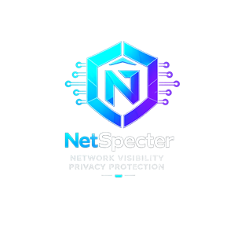
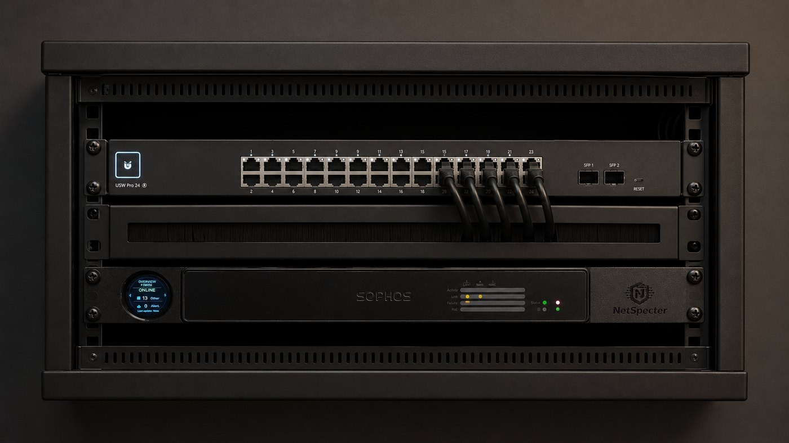

<p align="center">
  
</p>

<h1 align="center">NetSpecter v2</h1>

<p align="center">
  An inline network visibility and security appliance.
</p>

NetSpecter is an inline Debian-based appliance that provides network visibility, DNS analytics, service monitoring, internet-quality history, IDS detection, incident tracking, licence registration, and appliance health monitoring through one web interface.

It is designed for networks that need clearer visibility without replacing the router or firewall.

## The NetSpecter Appliance



NetSpecter is designed to run on a compact, rack-mountable x86 appliance with two or more Ethernet ports. The pictured unit is a repurposed Sophos appliance running NetSpecter, fitted with custom NetSpecter rack brackets and a live status display. The current bracket files are intended for Sophos SX/SG 125 Rev.3 units and may also fit SX/SG 135 Rev.3 hardware, but that fitment is not yet confirmed.

Printable STL files for the rack brackets and LCD back cover are in [hardware/sophos-sx-sg-125-rev3](hardware/sophos-sx-sg-125-rev3).

## Security Warning

NetSpecter is a LAN appliance. Do not expose the NetSpecter web interface, API, LCD endpoint, Gatus, AdGuard Home, SSH, or any appliance management port directly to the public internet.

Use NetSpecter only on trusted local networks or through a private VPN. Do not port-forward NetSpecter from the router, place it in a public DMZ, or publish it through a reverse proxy unless you fully understand and control the risk.

## Which Version Should You Use?

NetSpecter v2 is the feature-rich appliance build. It adds more monitoring, IDS, incident, backup, telemetry, and health features than the original NetSpecter.

For older architecture, simpler home deployments, or very small networks that do not need the extra v2 feature set, use the [original NetSpecter](https://github.com/irish-frog/netspecter) instead.

## What NetSpecter Does

| Area | Capability |
|---|---|
| Network visibility | Live devices, traffic, destinations, protocols, and per-device history |
| DNS analytics | AdGuard Home queries, blocked domains, services, and application activity |
| IDS | Suricata alert parsing, structured event details, priorities, and incident grouping |
| Incident response | Open incidents, acknowledgement, investigation history, block and ban actions |
| Monitoring | Gatus-backed HTTP, TCP, DNS, ping, TLS, SSH, and service checks |
| Internet quality | Latency, packet loss, jitter, DNS response time, and speed-test history |
| Appliance health | CPU, memory, disk, database, service, and collector status |
| Licensing | First-time NetLic registration, signed licence validation, daily check-ins, and offline grace state |
| LCD displays | Read-only token-protected summary endpoint for small LAN status displays |
| Change monitoring | Network, DNS, firewall, Suricata, and appliance configuration changes |
| Threat intelligence | Local threat-intelligence imports and indicator enrichment |
| Backups | Scheduled backup and restore tooling |

## Network Layout


```text
Internet -> Router -> NetSpecter bridge -> Switch -> Client devices
```

NetSpecter is installed inline as a transparent bridge. It requires two physical Ethernet ports. It does not replace the router or firewall.

DNS analytics require clients to use AdGuard Home on the NetSpecter appliance as DNS. See the [Bridge Configuration](docs/NETWORK-BRIDGE.md) and [AdGuard DNS](docs/ADGUARD.md) guides for the full setup path.

## Quick Install

Fresh Debian 13 appliance, run as `root`:

```bash
apt update
apt install -y git curl nano
cd /root
git clone https://github.com/irish-frog/netspecter-v2.git
cd netspecter-v2
bash ./install.sh
```

Then open:

```text
https://YOUR-NETSPECTER-IP:9443
```

On a fresh install, NetSpecter opens the first-time registration screen. This creates the local administrator account, registers the appliance with NetLic, stores the issued licence key locally, and then opens the dashboard.

For full preparation, bridge configuration, and service setup, see the [Installation Guide](docs/INSTALL.md).

## Documentation

| Guide | Description |
|---|---|
| [Installation](docs/INSTALL.md) | Prepare Debian and install NetSpecter |
| [First Setup](docs/FIRST-SETUP.md) | Complete the first login and minimum settings |
| [Bridge Configuration](docs/NETWORK-BRIDGE.md) | Configure the inline network bridge safely |
| [AdGuard DNS](docs/ADGUARD.md) | Configure DNS analytics and client DNS |
| [Suricata IDS](docs/SURICATA.md) | Install, configure, test, and troubleshoot IDS |
| [Incidents](docs/INCIDENTS.md) | Understand alert grouping, acknowledgement, investigation, and actions |
| [Monitoring](docs/MONITORING.md) | Configure Gatus service monitors and alerts |
| [Internet Quality](docs/INTERNET-QUALITY.md) | Understand latency, loss, jitter, and speed-test history |
| [UniFi Integration](docs/UNIFI.md) | Import UniFi client names and details |
| [Telegram Alerts](docs/TELEGRAM.md) | Configure Telegram notifications |
| [Settings Reference](docs/SETTINGS.md) | Configure retention, interfaces, services, and login settings |
| [Backups and Restore](docs/BACKUPS.md) | Use scheduled backups and restore tools |
| [Updating](docs/UPDATES.md) | Update an existing appliance safely |
| [Troubleshooting](docs/TROUBLESHOOTING.md) | Resolve common service, DNS, bridge, and database problems |
| [Architecture](docs/ARCHITECTURE.md) | Understand how the main NetSpecter components interact |
| [LCD Firmware](lcd/README.md) | Reference ESP32 firmware for tested 1.28 inch GC9A01 round status displays |
| [Third-Party Notices](THIRD_PARTY_NOTICES.md) | Third-party software, source, and licence notices |
| [FAQ](FAQ.md) | Common questions and limitations |
| [Development](docs/DEVELOPMENT.md) | Tests, code checks, services, and screenshot tooling |

## Hardware

| Use case | CPU | RAM | Storage | Network |
|---|---:|---:|---:|---|
| Minimum | 2 cores | 4 GB | 32 GB SSD | 2 Ethernet ports |
| Recommended | 4 cores | 8 GB | 64 GB SSD | 2 reliable Ethernet ports |
| IDS and longer retention | 4-8 cores | 8-16 GB | 128 GB SSD or larger | Intel i210/i350/i225/i226 or similar |

Use an SSD, not a USB flash drive. Two physical ports are required for the supported bridge deployment. Better NICs and CPU are recommended for high-speed links or heavy IDS usage.

## Main Services

| Service | Purpose |
|---|---|
| `netspecter-web.service` | Internal web UI and API on port 5050, available on the LAN through HTTPS on port 9443 |
| `netspecter-collector.service` | Bridge traffic collector and data importers |
| `netspecter-monitor.timer` | Monitor sync and alert processing |
| `netspecter-speedtest.timer` | Scheduled speed tests |
| `netspecter-vault.timer` | Scheduled backups |
| `netspecter-watchdog.timer` | Collector watchdog |
| `gatus.service` | Service-monitor engine |

## Licensing and Registration

NetSpecter is proprietary software. It may be free to use for selected releases, but may not be modified, copied, redistributed, resold, bundled, commercially hosted, or sold as an application or service without NetSpecter's prior written consent. See [LICENSE](LICENSE) and [EULA](EULA.md).

These NetSpecter restrictions do not apply to separately identified third-party software. Third-party components remain governed by their own licence terms.

NetSpecter registers with NetLic during first-time setup. The first public version supports free registration using the default `FREE` key. NetLic returns an issued licence key once, and NetSpecter stores it in the local encrypted configuration for daily signed check-ins.

NetLic is contacted by outbound HTTPS only. NetSpecter does not open inbound management ports for licensing, does not accept remote commands from NetLic, and does not send the local administrator password to NetLic.

If NetLic is temporarily unreachable after activation, NetSpecter keeps operating during the configured offline grace period. Core monitoring, local administration, existing data, logs, exports, and local access remain available.

## Third-Party Software

NetSpecter can install or integrate with AdGuard Home, an independent open-source DNS filtering service licensed under GNU GPL v3. NetSpecter does not own, modify, relicense, or claim ownership of AdGuard Home. The AdGuard Home project, source code and licence are available at https://github.com/AdguardTeam/AdGuardHome.

NetSpecter currently downloads and runs the official AdGuard Home upstream installer during local setup. NetSpecter does not currently bundle an AdGuard Home binary in this GitHub repository. AdGuard Home remains independently licensed under GPL-3.0.

NetSpecter does not modify, endorse, or claim a partnership with AdGuard Home. If you distribute an appliance image or package that includes AdGuard Home, include the AdGuard Home GPL-3.0 licence notice and any required source-code/licence information for that third-party component.

See [Third-Party Notices](THIRD_PARTY_NOTICES.md) for the AdGuard Home source, licence notice, and release packaging checklist.

Release packaging checklist when AdGuard Home is bundled:

- update the AdGuard Home version;
- verify the exact source URL;
- include `THIRD_PARTY_NOTICES.md`;
- include `licenses/AdGuardHome-GPL-3.0.txt`;
- include or publish the matching source, patches, and build/install scripts whenever the AdGuard Home binary is bundled.

## Important Notes

- Never expose NetSpecter directly to the public internet. Keep all appliance services LAN-only or behind a private VPN.
- NetSpecter is a visibility and detection appliance; it does not replace the network firewall.
- DNS blocking is a soft control and may be bypassed by cached DNS, direct IP connections, VPNs, or DNS-over-HTTPS.
- UniFi integration is optional.
- Suricata availability and performance depend on the operating system, hardware, and traffic volume.
- The supported deployment model is an inline bridge using two physical Ethernet ports.
- The LCD summary API is display-only and requires a generated LCD token. It does not grant admin access.
- NetLic records licensing and support metadata only; it does not collect browsing history, DNS history, packet captures, usernames, passwords, or detailed network activity.

## Project Status

NetSpecter v2 is active development. Expect frequent updates while the dashboard, monitor engine, IDS workflow, and setup flow continue to improve.
