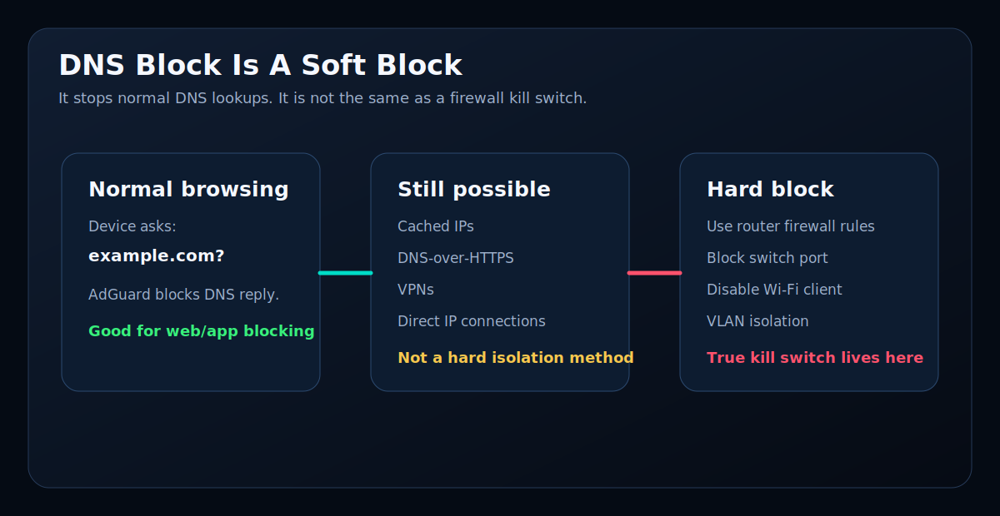

# AdGuard DNS

This guide covers AdGuard Home setup for DNS analytics and DNS blocking.

[<- Back to README](../README.md)

AdGuard Home is the DNS engine. NetSpecter imports query logs, client names, blocked domains, and blocked service data from it.

## Third-Party Licence Notice

AdGuard Home is separate third-party software licensed under the GNU General
Public License v3.0.

- Project and source: https://github.com/AdguardTeam/AdGuardHome
- Licence: https://github.com/AdguardTeam/AdGuardHome/blob/master/LICENSE.txt
- NetSpecter notices: [Third-Party Notices](../THIRD_PARTY_NOTICES.md)

## First AdGuard Wizard

On a new install, AdGuard opens its setup wizard on:

```text
http://YOUR-NETSPECTER-IP:3000
```

Recommended wizard choices:

- Web/admin interface: port `80`
- DNS server: port `53`
- Create an AdGuard username and password

After the wizard, AdGuard should open at:

```text
http://YOUR-NETSPECTER-IP
```

## NetSpecter AdGuard Settings

In NetSpecter:

```text
Services -> AdGuard
```

Set:

```text
AdGuard URL:      http://YOUR-NETSPECTER-IP
AdGuard username: your AdGuard username
AdGuard password: your AdGuard password
```

Save and test.

## Router DNS

For DNS analytics to work, clients must use NetSpecter/AdGuard as DNS.

In the router DHCP/LAN settings, set DNS server to the NetSpecter IP:

```text
Router DHCP DNS: YOUR-NETSPECTER-IP
```

Reconnect clients or renew DHCP leases.

Test from a LAN client:

```bash
nslookup google.com YOUR-NETSPECTER-IP
```

Expected result:

- Queries appear in AdGuard Home.
- NetSpecter shows activity in Applications and Blocked.

## AdGuard Blocklists

In AdGuard:

```text
Filters -> DNS blocklists
```

Recommended starting point:

- AdGuard DNS filter
- AdAway Default Blocklist
- Dandelion Sprout's Anti-Malware
- ShadowWhisperer's Malware List
- Malicious URL Blocklist

Then click:

```text
Check for updates
```

Do not add a huge pile of blocklists on day one. Too many lists can cause false positives and make troubleshooting harder.

## DNS Rewrites

For friendly local names:

```text
AdGuard -> Filters -> DNS rewrites
```

Example:

```text
netspecter -> YOUR-NETSPECTER-IP
```

DNS cannot include a port, so you still open:

```text
http://netspecter:5050
```

## DNS Blocking Is A Soft Block



DNS blocking may be bypassed by cached DNS, hardcoded DNS, DNS-over-HTTPS, VPNs, or direct IP connections. Use firewall/router rules when you need a hard network block.

---

Next:

- [Configure Telegram](TELEGRAM.md)
- [Configure monitoring](MONITORING.md)
- [Return to README](../README.md)
