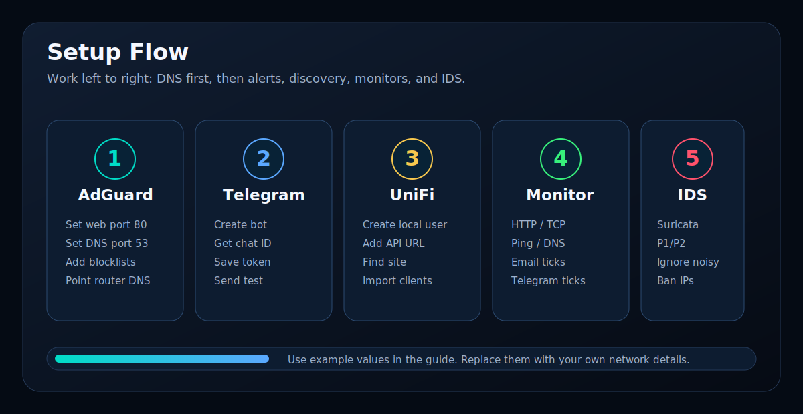

# First Setup

This guide covers the first login and the minimum settings needed after installation.

[<- Back to README](../README.md)

## Create The Admin User

Open:

```text
http://YOUR-NETSPECTER-IP:5050
```

If no admin exists, NetSpecter redirects to:

```text
/setup-admin
```

Create the first administrator account. The password must be at least 8 characters.

## Minimum Settings

Open:

```text
Settings
```

Review these areas first:

| Setting | What to enter |
|---|---|
| LAN prefix | Your LAN prefix, for example `192.168.1.` |
| Gateway IP | Router IP, for example `192.168.1.1` |
| Packet interface | Bridge interface, normally `br0` |
| AdGuard URL | AdGuard Home URL, normally `http://YOUR-NETSPECTER-IP` |
| Authentication | Keep enabled for normal deployments |

## Setup Flow



Recommended order:

1. Configure the bridge.
2. Configure AdGuard Home.
3. Add Telegram if you want alerts.
4. Enable Suricata IDS if available.
5. Add monitors.

## Expected Result

The dashboard should load and service cards should stop showing setup warnings as each integration is configured.

---

Next:

- [Configure the network bridge](NETWORK-BRIDGE.md)
- [Set up AdGuard Home](ADGUARD.md)
- [Return to README](../README.md)
