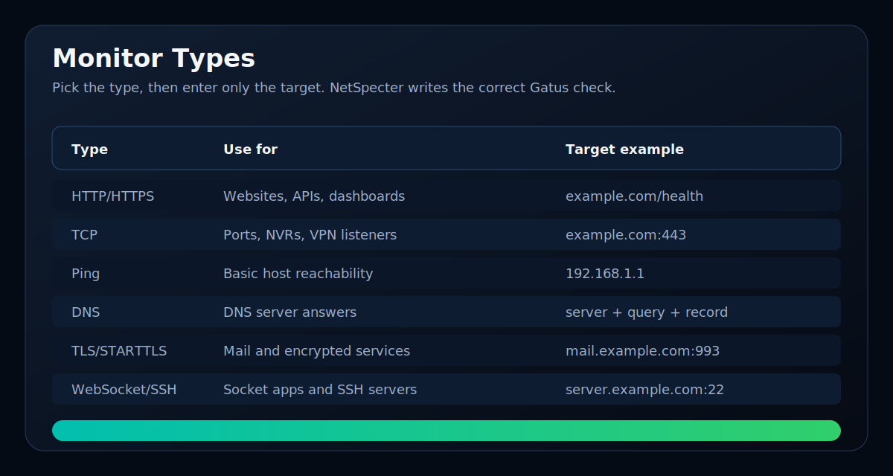

# Monitoring

This guide covers Gatus-backed service monitors and alerts.

[<- Back to README](../README.md)



NetSpecter uses Gatus for monitor cards and warning messages.

## Add A Monitor

Open:

```text
Network -> Monitor
```

Click:

```text
Add Monitor
```

Choose a monitor type:

| Type | Use it for | Target example |
|---|---|---|
| HTTP | Normal web/API endpoint | `example.com/health` |
| HTTPS | HTTPS web/API endpoint | `example.com` |
| TCP port | Camera/NVR/VPN/app port | `example.com:443` |
| UDP port | UDP service checks | `example.com:1194` |
| Ping | Basic host reachability | `192.168.1.1` |
| DNS | DNS server query checks | server `192.168.1.10`, query `example.com`, record `A` |
| TLS | TLS services | `mail.example.com:993` |
| STARTTLS | SMTP-style TLS upgrade | `smtp.example.com:587` |
| WebSocket | Plain WebSocket | `example.com/socket` |
| Secure WebSocket | Encrypted WebSocket | `example.com/socket` |
| SSH | SSH server | `server.example.com:22` |

For TCP, enter only:

```text
host:port
```

Do not enter:

```text
tcp://host:port
```

The dropdown adds the correct scheme.

## Alert Methods

Each monitor can use:

```text
Email warning
Telegram warning
```

Telegram uses:

```text
Services -> Telegram
```

Email uses the IDS email settings.

## Useful Checks

```bash
systemctl status gatus netspecter-monitor.timer --no-pager -l
sed -n '1,260p' /etc/netspecter/gatus/config.yaml
journalctl -u gatus -n 80 --no-pager
```

---

Next:

- [Configure Telegram](TELEGRAM.md)
- [Troubleshooting](TROUBLESHOOTING.md)
- [Return to README](../README.md)

