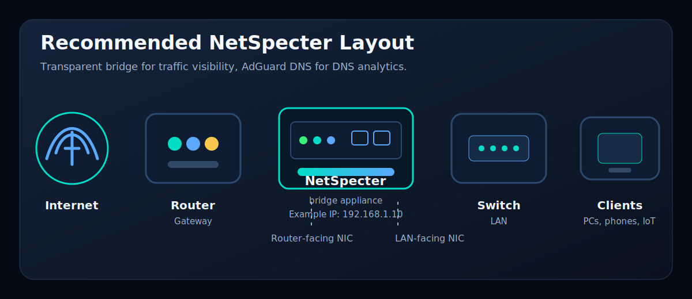

# Bridge Configuration

This guide covers the supported inline bridge deployment.

[<- Back to README](../README.md)

## Network Layout



```text
Internet -> Router -> NetSpecter bridge -> Switch -> Client devices
```

NetSpecter is installed inline as a transparent bridge. It needs two physical Ethernet ports:

- router-facing NIC
- LAN-facing NIC

NetSpecter does not replace the router or firewall.

## Example Bridge

```text
Router ---- enp1s0 | br0 | enp2s0 ---- Switch
```

Back up the current network config:

```bash
cp -a /etc/network/interfaces /etc/network/interfaces.before-netspecter
nano /etc/network/interfaces
```

## Static Management IP On The Bridge

Warning: changing bridge networking can disconnect SSH. Use local console access if possible.

Example `/etc/network/interfaces`:

```ini
auto lo
iface lo inet loopback

auto br0
iface br0 inet static
    address 192.168.1.10/24
    gateway 192.168.1.1
    dns-nameservers 192.168.1.1
    bridge_ports enp1s0 enp2s0
    bridge_stp off
    bridge_fd 0
    bridge_maxwait 0

iface enp1s0 inet manual
iface enp2s0 inet manual
```

Change these values before saving:

- `192.168.1.10/24` to the NetSpecter management IP
- `192.168.1.1` to the router IP
- `enp1s0 enp2s0` to the real bridge NICs

The management IP belongs on `br0`. Do not put IP addresses on the physical bridge ports.

Reboot:

```bash
reboot
```

Verify:

```bash
ip -br addr show br0
bridge link
ip route
ping -c 3 1.1.1.1
```

Expected result:

- `br0` shows the static IP.
- Both physical NICs show as bridge ports.
- The default route goes through the router on `br0`.

In NetSpecter settings, set the live traffic interface to:

```text
br0
```

---

Next:

- [Set up AdGuard Home](ADGUARD.md)
- [Complete first setup](FIRST-SETUP.md)
- [Return to README](../README.md)

